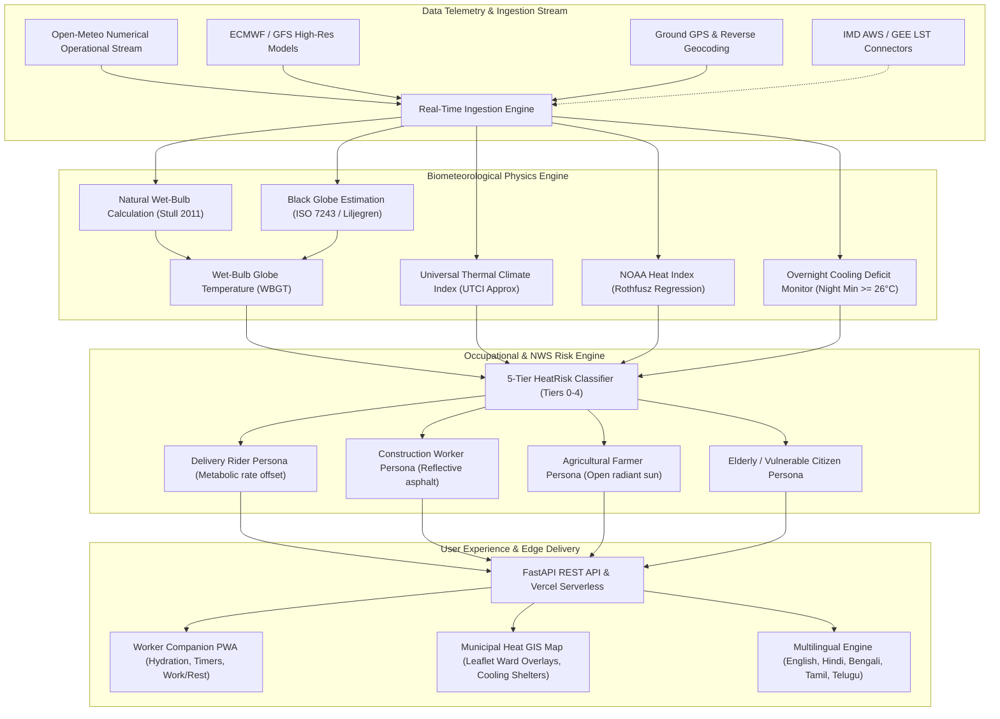

# ☀️ ThermoShield India
### Hyperlocal Biometeorological Heatwave Early Warning & Health Risk Intelligence Engine

[](https://github.com/RitamBiswas2007/Thermoshield/actions/workflows/ci.yml)
[](https://www.python.org/)
[](https://fastapi.tiangolo.com/)
[](https://vercel.com/)
[](https://opensource.org/licenses/MIT)
[](https://web.dev/progressive-web-apps/)

> **A production-grade, biometeorological forecasting platform built specifically for Indian summers, municipal disaster management authorities (NDMA/DDMA), and vulnerable outdoor gig/labor workforces.**

---

## 📌 Executive Summary

Traditional heatwave warnings in India rely predominantly on **ambient dry-bulb temperature (air temperature)**. However, physiological human heat stress is governed by a complex heat balance: **humidity, solar radiation flux, wind speed, metabolic rate, and nighttime recovery deficit**.

**ThermoShield India** bridges the gap between raw meteorological telemetry and actionable life-saving interventions by:
1. **Computing Hyperlocal Biophysical Indices**: Calculates **Wet-Bulb Globe Temperature (WBGT - ISO 7243)**, **Universal Thermal Climate Index (UTCI)**, and **NOAA Heat Index** in real time.
2. **Factoring the "Overnight Cooling Deficit"**: Triggers automatic risk tier escalation when nighttime temperatures fail to drop below 26°C—preventing cumulative cardiac and heat strain.
3. **Translating Risk into Occupational Protocols**: Converts physiological stress into mandatory **OSHA/NIOSH work-rest cycles**, required hydration volume ($ml/hour$), and shaded rest mandates for 4 occupational personas (*Delivery, Construction, Agriculture, Elderly*).
4. **Delivering Multilingual & Offline PWA Capabilities**: Instant emergency advisories in **5 languages** (*English, हिन्दी, বাংলা, தமிழ், తెలుగు*) with an offline-first service worker architecture.

---

## 🏛️ Reference Architecture Alignment

| Global Standard / Platform | ThermoShield Integration |
| :--- | :--- |
| **OSHA-NIOSH Heat Safety Standard** | Generates real-time physiological body strain metrics and translates them into **direct operational commands** (mandatory rest minutes, shaded canopy mandates, hydration cadence). |
| **NWS HeatRisk (NOAA / CDC)** | Implements a **5-Tier HeatRisk scale (Tier 0 to Tier 4)** with an automatic **Overnight Cooling Deficit Engine** (automatic +1 tier escalation if nighttime minimum $\ge 26^\circ\text{C}$). |
| **Copernicus ERA5-HEAT / ECMWF** | Calculates multi-node human thermal stress categories and radiant solar flux ($W/m^2$). |
| **National Disaster Management (NDMA)** | Municipal GIS command dashboard featuring ward-level hotspot markers, cooling center routing, and civic alert gateways. |

---

## 🏗️ System Architecture & Data Flow



---

## ⚡ Key Capabilities

### 1. Dual Operational Interfaces
* **👷 Worker Companion Mode**: Designed for field workers and gig delivery partners. Features large legible dials, active hydration alarms, rest-cycle counters, and heat stroke symptoms checklist.
* **🗺️ Municipal GIS Command Mode**: Designed for DDMA, municipal commissioners, and emergency response teams to pinpoint urban heat island (UHI) hotspots, inspect ward-level vulnerabilities, and deploy emergency mobile misting stations.

### 2. Operational Personas
* **🚚 Quick-Commerce / Delivery**: Accounts for traffic exhaust, protective helmets/jackets, and continuous transit.
* **🏗️ Construction Laborers**: Accounts for concrete/asphalt thermal reflection and heavy muscular exertion.
* **🌾 Agricultural Laborers**: Accounts for uninterrupted direct solar irradiance and high rural humidity.
* **👵 Elderly & High Risk**: Calibrated for lower thermoregulatory efficiency and chronic illness vulnerability.

### 3. Multi-Language Inclusivity
Instant one-click switching across 5 major Indian languages:
* **English**
* **हिन्दी (Hindi)**
* **বাংলা (Bengali)**
* **தமிழ் (Tamil)**
* **తెలుగు (Telugu)**

---

## 🚀 Deployment Options

### Option 1: Deploy to Vercel (Recommended for Live Demo)

The repository is pre-configured with `vercel.json` and a serverless entrypoint in `api/index.py`.

1. **Fork or push this repository** to your GitHub account:
   ```bash
   git push origin main
   ```
2. Go to **[vercel.com](https://vercel.com/)** and log in with GitHub.
3. Click **"Add New..."** > **"Project"**.
4. Select the **`Thermoshield`** repository and click **"Import"**.
5. Leave the default settings (Framework Preset: *Other*, Root Directory: `./`).
6. Click **"Deploy"**.
7. In ~60 seconds, your application will be live at `https://your-project.vercel.app`!

---

### Option 2: Run with Docker / Docker Compose

If you have Docker installed:

```bash
# Clone the repository
git clone https://github.com/RitamBiswas2007/Thermoshield.git
cd Thermoshield

# Launch the containerized application
docker compose up --build
```
Navigate to `http://localhost:8000` in your web browser.

---

### Option 3: Run Locally with Python

```bash
# 1. Clone repository
git clone https://github.com/RitamBiswas2007/Thermoshield.git
cd Thermoshield

# 2. (Optional) Create and activate virtual environment
python -m venv venv
# Windows:
.\venv\Scripts\activate
# Linux/macOS:
source venv/bin/activate

# 3. Install dependencies
pip install -r requirements.txt

# 4. Start FastAPI server with live reload
python -m uvicorn backend.main:app --host 0.0.0.0 --port 8000 --reload
```
Open `http://localhost:8000` in your browser.

---

## 📡 REST API Reference

All endpoints support both `/api/<route>` and `/<route>`.

| Endpoint | Method | Parameters | Description |
| :--- | :--- | :--- | :--- |
| `/api/realtime` | `GET` | `lat` (float), `lon` (float), `persona` (`delivery`\|`construction`\|`agriculture`\|`elderly`) | Computes real-time WBGT, UTCI, Heat Index, NWS Risk Tier, overnight cooling status, and OSHA protocols. |
| `/api/search` | `GET` | `q` (string, min 2 chars) | Hyperlocal geocoding lookup for any Indian city, town, or district. |
| `/api/reverse-geocode` | `GET` | `lat` (float), `lon` (float) | Reverse geocodes coordinates to street, district, pincode, and state. |
| `/api/presets` | `GET` | *None* | Returns pre-seeded meteorological data for top heat-vulnerable Indian metros. |
| `/api/integrations` | `GET` | *None* | Returns live status of active data streams and enterprise upgrade connectors. |
| `/api/health` | `GET` | *None* | Healthcheck endpoint reporting engine uptime and biometeorological algorithms. |

#### Example API Request:
```bash
curl "http://localhost:8000/api/realtime?lat=28.6139&lon=77.2090&persona=delivery"
```

---

## 🧪 Testing & Quality Assurance

Unit and biometeorological algorithm validation tests can be run locally:

```bash
python tests/test_api.py
```

Automated continuous integration is executed via **GitHub Actions** on every push (`.github/workflows/ci.yml`).

---

## 🔒 Security & Privacy

* **Zero-Tracker Client**: No third-party profiling or advertising trackers.
* **Safe Geolocation**: GPS coordinates are processed transiently in memory to query numerical weather feeds and are never persisted without user consent.
* **Sanitized Secrets**: `.gitignore` and `.dockerignore` ensure that no private `.env` files or GCP Service Account keys (`credentials/*.json`) are ever pushed upstream.

---

## 📜 License

This project is open-source and licensed under the [MIT License](LICENSE).
